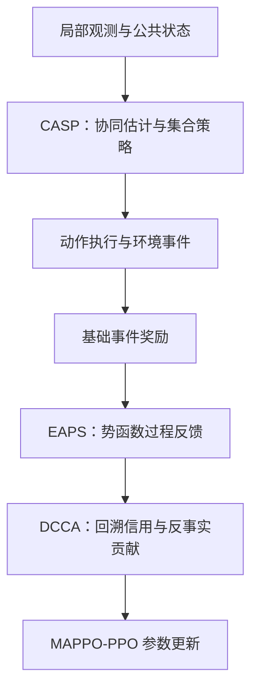

# EC-MAPPO 创新框架界定：MAPPO⁰ + DCCA + EAPS + CASP（数据集无关版）

> **文档用途**：本文档规定 EC-MAPPO 创新框架的**构成边界**——公共实验框架（含 MAPPO⁰ 消融底座）与三个创新模块 DCCA、EAPS、CASP 各自**包括什么、不包括什么、如何开关**。它是后续《EC-MAPPO 消融实验需求文档》的唯一方法学依据。
>
> **数据集无关声明**：本文档**不绑定任何数据集版本**（v3 / v4 / v5 或未来版本），也不预设实例划分、训练预算档位、输出目录编号与命令行细节。执行 Agent 必须基于**项目代码现状 + 本文档 + 用户指定的目标数据集**，另行生成完整的消融实验需求文档，并在其中确定全部执行锚点（数据集与划分、训练/评估命令、预算档位、种子策略、目录与编号、指标口径）。
>
> **核心等式（本文档全部内容的出发点）**：
>
> \[
> \mathrm{EC\text{-}MAPPO} := \mathrm{MAPPO}^{0}+\mathrm{DCCA}+\mathrm{EAPS}+\mathrm{CASP}.
> \]
>
> 其中 MAPPO⁰ 不是任何历史 MAPPO 实现，而是「同一 EC-MAPPO 实验框架内三模块全关」的统一定义（见 §0–§2）。

## 0. 首要规则：历史 MAPPO 与本次消融完全隔离

本次消融实验中，过去单独实现、训练和评估过的 MAPPO **视为不存在**。后续 Agent 不得用它来完成以下任何工作：

- 不得以其网络结构、训练脚本、超参数或输出结果定义本次消融底座；
- 不得要求新底座复现其指标、参数量、训练曲线或 checkpoint；
- 不得把它放入消融主表，也不得以其结果作为新底座的验收阈值；
- 不得根据它与 EC-MAPPO 的历史差异，反推三个模块的边界。

原因是：历史实现服务于当时的算法对比，并未事先按照「EC-MAPPO 关闭三个创新模块」这一严格定义构造。若继续把它作为参照，两个实现之间无法归入三模块的差异也会混入实验，最终无法判断性能变化究竟来自模块消融，还是来自独立实现、网络结构、初始化或训练流程的差异。

因此，本实验重新定义一个只属于消融研究的统一底座：

> **MAPPO⁰（消融底座）= 在 EC-MAPPO 的统一实验框架内，同时关闭 DCCA、EAPS 和 CASP 后，从头训练得到的策略。**

MAPPO⁰ 是本研究内部的操作性定义，不承担「逐项复刻某篇传统 MAPPO 论文」的任务。后续若需要做一般算法横向对比，应另建基线表，不能反向影响本次消融设计。

### 0.1 项目代码库中的历史 MAPPO 清单（点名）

本项目代码库中，以下对象即 §0 所指「历史 MAPPO」，其训练脚本、训练流程、超参缺省、checkpoint、在任何数据集版本上的训练产物与早停配置**均不得**用于定义消融底座或作为验收参照：

- 独立的 MAPPO 训练器（如 `marl/train_mappo.py`）；
- 其在任何数据集版本上的全部输出产物（`output/` 下对应的实验目录及其衍生评估、泛化目录）；
- 任何历史报告主表中该基线的数字。

**边界澄清（避免矫枉过正）**：基础网络实现文件（如 `marl/baseline_net.py`）中与 MAPPO⁰ 定义对应的组件——共享 MLP + 目标池化且无注意力的基础得分网络（如 `PoolMLPNet`）、纯状态价值 Critic（如 `StateCritic`，\(V(s)\)，无联合动作条件）——**允许**作为 MAPPO⁰ 对应组件在统一管线内的**结构实现参考**：它们正是 §2 对 MAPPO⁰「基础得分网络 / 集中式状态价值」定义的现成形态，复用结构定义不等于复用历史实现。被禁止的是复用其训练脚本、产物与验收参照，而不是重造一个结构等价但实现不同的网络——后者反而会引入 §0 要排除的实现差异。

## 1. 核心结论与统一表达

本创新框架的三个模块固定为：

| 编号 | 模块 | 英文名称 | 主要作用位置 | 解决的问题 |
|---|---|---|---|---|
| 模块 1 | **DCCA：双通道信用分配** | Dual-Channel Credit Assignment | 个体优势与信用归因 | 延迟结算、多平台共同交战时，个体贡献难区分 |
| 模块 2 | **EAPS：事件感知势函数塑形** | Event-Aware Potential Shaping | 团队奖励序列 | 击杀与泄漏反馈滞后，训练奖励稀疏 |
| 模块 3 | **CASP：协同感知集合策略** | Coordination-Aware Set Policy | Actor 的输入与策略表示 | 无通信下他台在途火力不可见，目标集合动态变化 |

在统一实验框架中，采用以下定义：

\[
\mathrm{EC\text{-}MAPPO}
:=\mathrm{MAPPO}^{0}+\mathrm{DCCA}+\mathrm{EAPS}+\mathrm{CASP}.
\]

这里的「+」表示在同一训练管线和公共任务框架中启用对应模块，不表示沿用旧模型权重，也不表示三个模块的性能增益可以直接相加。每个实验臂都必须按照自己的开关配置独立初始化、独立训练。

三个模块位于不同方法环节，因而可以分别开关；但它们的**效果并不相互独立**：EAPS 改变 DCCA 所使用的团队回报，CASP 会改变采样到的动作与事件分布，DCCA 又会影响 Actor 如何利用 CASP 提供的表示。因此，准确表述应是「模块边界可分、实现开关可分、效果可能交互」，不能写成「三模块彼此正交、贡献可直接相加」。

## 2. MAPPO⁰ 与三模块共享的公共框架

消融的原则是只改变三个创新模块，其他条件保持一致。以下内容属于**公共实验框架**，不归入任何一个创新模块，所有实验臂都必须保留：

| 公共项 | 统一要求 | 保留原因 |
|---|---|---|
| 任务环境与数据划分 | 使用相同实例、动力学、训练/验证/测试划分（具体数据集版本与划分由需求文档确定并冻结） | 防止任务难度变化混入模块效应 |
| 信息边界 | Actor 始终只读取合法局部观测和公共先验 | 保证各臂执行时拥有相同信息权限 |
| 基础动作语义 | 动作均为「保留弹药」或选择当前目标 | 这是任务接口，不是某一模块的专属创新 |
| 可行性掩码 | 存活、交战窗口、弹着时限和弹药约束统一硬屏蔽 | 保证比较的是决策质量，而不是学习合法动作的能力 |
| 基础事件奖励 | 击杀、泄漏及无效交战惩罚使用统一定义 | EAPS 只负责额外势函数塑形，不重新定义任务目标 |
| MAPPO 训练骨架 | 参数共享的分散 Actor、集中训练、PPO-Clip、GAE、熵正则等 | 构成所有实验臂共同的优化底座 |
| 训练与评估协议 | 训练预算、早停规则、随机种子、评估实例和指标口径一致 | 排除预算和统计口径造成的混淆 |

由此，MAPPO⁰ 的具体形态为：

- Actor 使用不含协同估计、不含目标间注意力的基础得分网络；为兼容变长目标集合，可采用共享目标 MLP 与固定池化上下文，但不能包含 CASP 的协同通道或集合注意力机制；
- 奖励只使用统一的基础事件奖励，不叠加 EAPS 势函数项；
- Critic 使用集中式状态价值函数 \(V_\psi(s_t)\)，各平台共享基于团队回报计算的 GAE，不加入 DCCA 的事件回溯信用和反事实贡献项；
- 其余公共组件全部与 EC-MAPPO 保持一致。

这一定义保证 MAPPO⁰ 与完整方法之间的受控差异**恰好是 DCCA、EAPS 和 CASP**。

## 3. 三个模块分别代表什么

### 3.1 模块 1：DCCA 双通道信用分配

#### 目标问题

拦截弹发射后需要经过若干决策步才结算，多个平台还可能先后对同一目标发射。若只把团队奖励广播给所有平台，无法回答「是哪一个平台、在哪一个历史时刻作出的动作产生了贡献」。DCCA 的任务不是改变环境奖励，而是把已有团队结果转换为更有区分度的个体训练信号。

#### 两个通道

1. **事件回溯通道**：目标发生击杀事件后，将相应击杀收益按照项目规定的贡献规则分配给与该目标交战的有效拦截弹，并把信用记回各自的发射时刻。它解决「反馈何时发生」与「动作何时作出」不一致的问题。
2. **反事实贡献通道**：使用动作条件化的联合价值估计，对比真实联合动作与「仅把平台 \(i\) 的动作替换为保留弹药」两种情况，估计该平台当次行动的边际贡献。

为避免论文符号产生歧义，动作条件化的联合价值在方法描述中建议统一记为 \(Q_\psi(s_t,\mathbf a_t)\)，即使工程变量曾使用其他命名。启用 DCCA 时，个体优势可概括为：

\[
A_{i,t}=A_t^{\mathrm{team}}
+\alpha C_{i,t}^{\mathrm{trace}}
+\beta\bigl[Q_\psi(s_t,\mathbf a_t)-Q_\psi(s_t,\mathbf a_{t,-i},\mathrm{hold}_i)\bigr].
\]

其中 \(C_{i,t}^{\mathrm{trace}}\) 为回溯到发射时刻的事件信用，\(\alpha,\beta\) 及归一化方式在各实验臂中固定。

#### 关闭 DCCA 时必须同步发生的变化

- 删除事件回溯信用；
- 删除反事实贡献差；
- 动作条件化联合价值网络退化为集中式状态价值网络 \(V_\psi(s_t)\)；
- 个体优势退化为共享团队 GAE。

以上四项是同一个原子开关，不能只关闭其中一部分后仍称为「w/o DCCA」。DCCA 是纯训练侧模块，关闭后不应改变部署时的 Actor 结构。

#### 建议观察的机制指标

- 各平台优势的区分度与方差；
- 获得非零回溯信用的历史动作比例；
- 训练稳定性与跨训练种子的波动；
- 最终泄漏率、无效交战率、毁伤价值和单位弹药毁伤价值。

### 3.2 模块 2：EAPS 事件感知势函数塑形

#### 目标问题

环境的主要结果在击杀、突防或期末才出现，而决策在更早的发射时刻发生。仅使用基础事件奖励时，大量决策步的奖励为零，策略难以及时判断当前在途火力对未来结果产生了什么影响。

EAPS 从未结算的在途交战状态构造势函数，并把相邻状态的势差加入基础奖励：

\[
\tilde r_t=r_t^{\mathrm{event}}+\gamma\Phi(s_{t+1})-\Phi(s_t).
\]

项目中的 \(\Phi\) 由存活目标价值及其在途火力覆盖所形成的期望毁伤状态构造，用于把延迟结果转化为逐步过程反馈。论文中若要使用「不改变最优策略」的表述，必须同时说明其成立条件，包括状态定义完备、采用标准势差形式以及终端势正确处理；不能无条件作绝对化承诺。

#### 关闭 EAPS 时必须保持的内容

- 只移除 \(\gamma\Phi(s_{t+1})-\Phi(s_t)\)；
- 击杀、泄漏和无效交战惩罚等基础事件奖励全部保留；
- 不改变 Actor、Critic、动作空间和可行性掩码；
- 若 DCCA 同时开启，DCCA 继续工作，但其团队 GAE 改为基于未塑形的基础事件奖励计算。

EAPS 也是纯训练侧模块，不增加部署时的网络输入或推理计算。

#### 建议观察的机制指标

- 非零奖励步占比与奖励密度；
- 回报或优势的方差；
- 达到相同验证性能所需的训练步数；
- 最终泄漏率、毁伤价值及跨训练种子稳定性。

### 3.3 模块 3：CASP 协同感知集合策略

#### 目标问题

执行阶段无显式通信，他平台的在途火力不可直接观察；同时，目标分批到达、离场，当前目标数量持续变化。固定维度策略难以同时表达目标间竞争关系、他台可能的火力承诺以及「当前应打谁或保留弹药」。

#### 两个组成部分

1. **协同状态估计**：依据公共弹药池变化、平台自身发射记录和合法局部观测，递推估计他平台对各目标的潜在火力承诺，并把该估计作为目标级协同特征。
2. **集合策略表示**：把当前目标视为无序变长集合，通过集合注意力建模目标间关系，再结合平台状态和公共状态输出「保留弹药 + 各可行目标」的动作得分。

CASP 作用于 Actor 的输入和函数形式，是三个模块中唯一直接改变在线执行策略结构的模块。

#### 关闭 CASP 时必须同步发生的变化

- 移除目标级他台火力承诺估计及其专属协同事件通道；
- 用不含目标间注意力的基础共享 MLP/固定池化得分器替代集合注意力策略；
- 保留通用局部目标状态、自身在途信息、公共弹药余量、保留弹药动作和可行性掩码；
- 不改变 EAPS 或 DCCA 的训练逻辑。

在三模块主实验中，「协同状态估计 + 集合注意力」作为一个完整 CASP 模块共同开关。若后续需要解释 CASP 内部哪一部分更重要，可追加模块内消融，但不能用模块内消融替代三模块主实验。

#### 建议观察的机制指标

- 重复瞄准次数或无效交战率；
- 单目标同时被多平台覆盖的程度；
- 动态目标规模变化时的性能与稳定性；
- Actor 参数量、纯前向时延和单位弹药毁伤价值。

## 4. 三模块在 EC-MAPPO 中的实际流程

模块编号按照论文研究问题排列，但真实的数据流顺序不是 DCCA→EAPS→CASP，而是：



其中：

- CASP 决定 Actor 如何理解当前局面并产生动作；
- EAPS 决定一次轨迹被转换成怎样的团队奖励序列；
- DCCA 决定团队结果如何形成各平台、各历史动作的训练优势；
- MAPPO 核心负责使用上述优势更新共享 Actor。

这一流程也解释了为什么三个模块可以分别关闭，却可能产生交互效应。

## 5. 消融实验组合设计

统一采用三个二值开关：

- \(D\)：DCCA，1 为开启，0 为关闭；
- \(E\)：EAPS，1 为开启，0 为关闭；
- \(C\)：CASP，1 为开启，0 为关闭。

配置 \((D,E,C)=(0,0,0)\) 即 MAPPO⁰，\((1,1,1)\) 即完整 EC-MAPPO。

**方案选择规则（数据集与预算无关的方法学规则）**：本文档不预设算力预算。需求文档 Agent 必须先基于目标数据集与代码现状完成**预算核算**（冒烟实测训练速率，流程见附录 A.6），再在以下三种方案中定档并在需求文档中记录核算依据：§5.1 六臂方案为**缺省推荐**；核算结论为「六臂不可行」时才降级至 §5.2；预算充足时升级 §5.3。执行 Agent 不得跳过核算自行选档，也不得对不同实验臂使用不同档位。

### 5.1 最低推荐方案：6 个唯一实验臂

若目标既包括展示「MAPPO⁰ + 模块 1 + 模块 2 + 模块 3 = EC-MAPPO」的递增过程，又包括验证每个模块在完整系统中的必要性，最低推荐以下 6 个唯一配置：

| 实验臂 | D | E | C | 主要用途 |
|---|:---:|:---:|:---:|---|
| **B0：MAPPO⁰** | 0 | 0 | 0 | 统一消融底座 |
| **B1：MAPPO⁰ + DCCA** | 1 | 0 | 0 | 递增阶段 1，观察模块 1 单独加入后的变化 |
| **B2：MAPPO⁰ + DCCA + EAPS** | 1 | 1 | 0 | 递增阶段 2；同时等价于完整方法 w/o CASP |
| **B3：EC-MAPPO** | 1 | 1 | 1 | 完整方法 |
| **A-D：w/o DCCA** | 0 | 1 | 1 | 检验 DCCA 在 EAPS、CASP 已开启时的条件贡献 |
| **A-E：w/o EAPS** | 1 | 0 | 1 | 检验 EAPS 在 DCCA、CASP 已开启时的条件贡献 |

由此得到两组互补证据：

1. **递增式路径**：B0 → B1 → B2 → B3，直观呈现从统一 MAPPO⁰ 到完整 EC-MAPPO 的构建过程；
2. **留一式路径**：B3 分别对比 A-D、A-E、B2，检验在其余模块存在时去掉某一模块会造成什么变化。

B2 同时承担「递增阶段 2」和「w/o CASP」两个角色，因此不是重复训练臂。递增式增益依赖 DCCA→EAPS→CASP 的加入顺序，只能解释这条预先规定的构建路径；模块的条件必要性应以留一式对比为主。

### 5.2 预算受限方案：5 臂留一消融

若算力只能支撑 5 个配置，可使用：

\[
000,\ 111,\ 011,\ 101,\ 110.
\]

即 MAPPO⁰、完整 EC-MAPPO 和三个 w/o 臂。该方案可以回答「完整系统去掉某模块是否退化」，但不能完整展示按模块 1→2→3 逐步构建的过程。因此它是预算受限方案，不是最符合本文目标的首选方案。

### 5.3 论文级完整方案：\(2^3=8\) 臂全因子设计

若训练成本可接受，推荐训练全部八种组合：

| 配置 | D | E | C | 含义 |
|---|:---:|:---:|:---:|---|
| 000 | 0 | 0 | 0 | MAPPO⁰ |
| 100 | 1 | 0 | 0 | 仅 DCCA |
| 010 | 0 | 1 | 0 | 仅 EAPS |
| 001 | 0 | 0 | 1 | 仅 CASP |
| 110 | 1 | 1 | 0 | DCCA + EAPS |
| 101 | 1 | 0 | 1 | DCCA + CASP |
| 011 | 0 | 1 | 1 | EAPS + CASP |
| 111 | 1 | 1 | 1 | EC-MAPPO |

全因子设计能同时估计三个模块的平均主效应、两两交互和三阶交互，是判断「模块是否互补」最完整的方案。若最终论文需要强调三模块组合机制，八臂方案优于只做三条 w/o 对比。升级为八臂时，相对六臂方案仅新增「仅 EAPS」「仅 CASP」两臂，其余六配置与六臂方案重合，不得重复训练。

## 6. 后续需求文档必须规定的实现原则

### 6.1 单管线、三开关

所有实验臂必须来自同一套采样、训练、验证和评估管线，仅由 `use_dcca`、`use_eaps`、`use_casp` 三个逻辑开关决定差异。不得为 MAPPO⁰ 或某个 w/o 臂另写一套独立训练流程。

三开关至少需要满足以下语义：

| 开关 | 开启 | 关闭 |
|---|---|---|
| `use_dcca` | 回溯信用 + 反事实差 + 动作条件化联合价值 | 纯团队 GAE + 状态价值 Critic |
| `use_eaps` | 基础事件奖励 + 势函数塑形 | 仅基础事件奖励 |
| `use_casp` | 协同特征 + 集合注意力 Actor | 基础局部特征 + 非注意力 Actor |

所有八种开关组合都应能够独立完成训练与评估。配置之间不得通过加载上一阶段权重进行串行微调；相同训练种子只用于对齐初始化随机性和采样协议。

### 6.2 开关影响范围必须可审计

需求文档应要求输出一张「开关—受影响组件—不受影响组件」对照表，并通过单元测试或运行日志确认：

- 关闭 EAPS 只改变送入 GAE 的奖励序列；
- 关闭 DCCA 只改变 Critic/优势构造，不改变 Actor 输入和执行路径；
- 关闭 CASP 只改变 Actor 的协同特征与表示网络，不改变奖励和优势算法；
- 公共动作接口、可行性掩码、基础事件奖励和数据协议始终不变。

### 6.3 两个关键等价性验收

1. **全开验收**：\((1,1,1)\) 必须与改造前 EC-MAPPO 的方法语义一致。可用固定小样本、固定种子的前向输出和短程训练日志验证，确保新增开关没有改变默认完整方法。
2. **全关验收**：\((0,0,0)\) 必须能够从头正常训练、无非法动作、无 NaN，并确认三模块专属信号均未进入计算图。它只需满足本文对 MAPPO⁰ 的定义，**不需要与任何历史 MAPPO 结果一致**。

两项验收的可执行操作步骤（含遗留参数冻结条件、比对口径与通过判据）见**附录 A.3 / A.4**；执行 Agent 不得自行降低验收标准。

### 6.4 Checkpoint 与结果元数据

每个 checkpoint 和实验报告至少记录：

- 三个模块开关；
- Actor/Critic 类型及输入规格；
- Actor 与 Critic 参数量；
- 训练种子、数据集版本与数据划分、训练预算与早停点；
- 奖励版本、优势版本和评估协议版本。

评估程序必须依据 checkpoint 元数据恢复正确结构，不能根据文件夹名称猜测模型类型。元数据字段规格见**附录 A.5**。

## 7. 公平训练与统计协议

### 7.1 必须一致的训练条件

所有实验臂统一：

- 训练、验证和测试实例；
- 最大训练步数、每轮采样量、优化器、学习率、PPO 轮数、批大小、熵系数和梯度裁剪；
- 验证频率、早停耐心值和 checkpoint 选择规则；
- 环境随机流、策略随机流和数据划分随机流的隔离方式；
- 测试时的确定性/随机性设置。

不得单独为某一消融臂调参。若确需调参，应预先规定所有实验臂共同使用的搜索空间和选择规则。

**预算档位统一原则**：需求文档必须规定统一的预算档位（iters / episodes-per-iter / patience 等）与分阶段种子策略，并附预算核算表（附录 A.6）。所有实验臂必须采用同一档位；档位一经冒烟定档，不得对单臂调整，若调整须整批同步重跑。

### 7.2 训练种子与环境种子不能混为一谈

正式论文实验建议每个配置至少使用 **3 个独立训练种子**；预算允许时使用 5 个。每个训练所得 checkpoint 再在相同的测试实例与相同环境种子上评估。大量环境 Monte Carlo 种子只能衡量结算随机性，不能替代多训练种子对强化学习优化稳定性的检验。

若当前阶段只跑 1 个训练种子，结果应标记为「实现验证/初步消融」，不宜据此作稳定的模块优劣结论。

### 7.3 指标分层

主表至少报告：

1. **任务主指标**：泄漏价值比例；
2. **交战质量指标**：无效交战率、摧毁价值；
3. **资源效率指标**：单位发射弹药的摧毁价值；
4. **稳定性指标**：不同训练种子的均值、标准差或置信区间；
5. **工程指标**：Actor 参数量与纯策略前向时延。

具体指标口径（指标项数、统计方式、自检项）以目标数据集说明文档及需求文档为准。模块机制指标单独成表或成图，不替代任务主指标：DCCA 看信用与优势统计，EAPS 看奖励密度和收敛速度，CASP 看重复交战与动态规模适应性。

### 7.4 配对比较

所有配置在相同的「测试实例 × 环境种子」上评估，报告同一配对单元上的指标差值、95% 置信区间及配对检验结果。正式结论还需跨训练种子汇总，不能把同一训练模型下的多次环境结算当作多个独立训练结果。

测试集只能用于最终评估，不能用于选择模块开关、超参数或最佳训练迭代。若测试实例数量较少，应分别报告各实例结果，避免把环境种子数量误写成实例泛化证据。

## 8. 结果应如何解释

### 8.1 推荐的核心对比

| 要回答的问题 | 对比 |
|---|---|
| 三模块整体是否有效 | EC-MAPPO（111） vs MAPPO⁰（000） |
| DCCA 在完整系统中是否必要 | 111 vs 011 |
| EAPS 在完整系统中是否必要 | 111 vs 101 |
| CASP 在完整系统中是否必要 | 111 vs 110 |
| 从底座逐步构建是否形成增益 | 000 → 100 → 110 → 111 |
| 模块间是否存在互补或抵消 | 八臂全因子对比及交互效应 |

### 8.2 允许与不允许的结论

- 若 111 显著优于 000，可说明三模块组合相对统一 MAPPO⁰ 有效；
- 若 111 优于某个 w/o 臂，可说明该模块在其余两模块存在时具有条件贡献；
- 若某模块只改善无效交战率或收敛稳定性，而泄漏率差异不显著，应按机制指标如实表述，不能扩大为全面性能提升；
- 若递增路径不是单调改善，应优先检查训练方差与模块交互，不能强行把每一阶段写成正贡献；
- 若 111 与 000 差异落在训练方差内，不能仅凭单个最佳 checkpoint 宣称三模块有效；
- 三个留一差值不能直接相加后当作「总提升」，因为模块之间存在交互。

### 8.3 需要额外控制的混淆因素

CASP 开启后 Actor 参数量通常会增加，DCCA 开启后 Critic 结构也会变化。因此主表需分别报告 Actor/Critic 参数量。若 CASP 的优势较小，建议追加参数量匹配的非注意力 Actor 作为稳健性对照，以排除「只是网络更大」的解释。

## 9. 交给需求文档 Agent 的直接任务清单

后续 Agent 应基于本文档、项目代码现状与用户指定的目标数据集，完成以下内容：

1. **冻结执行锚点**：确定目标数据集版本与 train/val/test 划分（以该数据集的 `MANIFEST` 与说明文档为准）、训练/评估命令与 CLI 参数、终评 MC 种子、输出目录与实验编号（按项目实验序列顺延）、指标与自检口径——以上全部写入需求文档，不得沿用本文档未规定的缺省；
2. 先定义 MAPPO⁰ 的公共组件与全关行为，不读取或复用历史 MAPPO 作为设计依据；
3. 把 DCCA、EAPS、CASP 实现为三个边界清楚的原子开关，并明确依赖组件的联动关系；
4. 采用单训练管线支持至少六臂方案，最好支持完整八臂全因子方案；
5. 为全开、全关及各单模块开关编写行为验收，证明开关没有越界影响其他模块；
6. 规定统一训练预算、多训练种子、成对终评和分层指标（含预算核算与冒烟定档记录）；
7. 输出实验配置表、训练产物规范、评估汇总格式和结果解释模板；
8. 在文档中明确：旧 MAPPO 不参与本消融实验的设计、验收、结果表或结论解释。

## 10. 一句话总结

本次消融不比较「EC-MAPPO 与过去另写的 MAPPO」，而是在**同一个 EC-MAPPO 实验框架内**，以三模块全关得到 MAPPO⁰，再通过 DCCA、EAPS、CASP 的独立开关和组合实验，验证完整方法相对统一底座的整体增益、各模块在完整系统中的条件贡献，以及模块之间可能存在的交互作用。**框架构成（本文档规定）与执行锚点（需求文档规定）分离，任何数据集版本上的消融都必须遵循同一套模块边界定义。**

---

## 附录 A：实现与验收的通用工程要求（代码库绑定、数据集无关）

> 本附录把正文的方法学定义对应到项目代码库（`WTA-Dn-branch01`），给出跨数据集通用的工程规则。**所有数据集特定的执行锚点（数据目录、划分、预算数字、目录编号、种子清单）一律不在此规定，由需求文档按目标数据集确定。** 本附录的代码符号为概念锚点：需求文档 Agent 必须逐符号核对代码现状，正文条款与代码现状冲突时，先核对代码现状再回写本文档，不得静默偏离正文语义。

### A.1 单管线宿主与模块↔代码概念地图

单管线宿主：**`marl/train.py`**（EC-MAPPO 主训练器）。三开关在此改造为**构造期分支**（网络结构与输入维度一次确定，训练中不变）；不得为任何臂另建独立训练脚本。

| 模块 | 开启时涉及的代码位置 | 关键符号与语义 |
|---|---|---|
| DCCA·通道 1（事件回溯信用） | `marl/reward.py` → `build_rewards()` | 返回的 `credit` 字典：击杀价值按 `p_shot` 比例分摊给击杀时刻在途的各发射槽 `(t_fire, i)`，下游 `train.py` 的 `process_batch` 经 `credit.get((t,i))` 注入个体优势 |
| DCCA·通道 2（反事实贡献） | `marl/train.py` → `CriticNet`（\(V(s,\mathbf a)\)，含 per-agent 动作块）与 `critic_inputs()` | 动作条件化联合价值；「平台 i 改为保留弹药」的 hold 反事实差 |
| EAPS（势函数塑形） | `marl/reward.py` → `build_rewards()` | \(\Phi\) 由存活目标价值与在途火力覆盖构造，终端势置零；`R_shaped = R_team + phi_sign·(γΦ_{t+1} − Φ_t)`，塑形折扣系数为代码常量 |
| CASP·协同状态估计 | `marl/perceive.py` → `AgentMemory`（λ̂ 递推）+ `build_inputs()` | λ̂ 火力承诺估计与 n̂ 友军火力估计等**协同特征列**（具体列号与输入维度以代码现状为准） |
| CASP·集合策略 | `marl/network.py` → `MarlNet`（集合注意力 Actor） | hold-first logits，置换不变 |
| 公共骨架 | `marl/train.py` → `Trainer` | PPO-Clip、GAE、熵正则、可行性掩码 |

MAPPO⁰ 组件现成结构参考：`marl/baseline_net.py` 的 `PoolMLPNet`（共享 MLP + 目标池化，hold-first，无注意力）与 `StateCritic`（\(V(s)\)，无联合动作条件），使用边界见 §0.1。

**维度推导红线**：所有智能体数、目标数等维度必须由数据集实例参数推导；代码中的 legacy 平台数常量（如 `N_AGENTS`）禁止用作训练期维度源。

### A.2 遗留参数冻结（防止双重开关）

`marl/train.py` 现有历史实验参数，消融管线中的处置：

| CLI 参数 | 缺省 | 消融中的处置 |
|---|---|---|
| `--credit-mode {credit_kill, credit_kill_cf}` | `credit_kill` | **冻结缺省**。两值语义相同（`credit_kill_cf` 仅为兼容别名）；DCCA 通道 2 的真开关是 `use_dcca`（`CriticNet` 结构切换），与此参数无关 |
| `--phi-sign {-1.0, 1.0}` | `-1.0` | **冻结缺省符号**。符号翻转属正向控制臂，不在本消融范围；`use_eaps=0` 必须通过「不叠加 γΦ_{t+1}−Φ_t 势差项」实现，**不得**以翻转或置零 `phi_sign` 模拟关闭 |
| `--c-invalid` | `None` | 冻结缺省（无效惩罚属公共框架，各臂一致） |
| `--init-from` / `--init-blend` | — | 消融中**禁用**（§6.1 禁止跨臂加载权重串行微调） |

三开关接管语义后，任何臂不得再经遗留参数引入额外差异轴；消融训练命令中不得出现上表「处置」列标注为冻结/禁用之外取值。

### A.3 全开验收的可执行步骤（(1,1,1) ≡ 改造前 EC-MAPPO）

1. 三开关全开 + A.2 全部冻结值下，与改造前代码在**同 `--seed`、同 data-dir、同超参**下各跑 ≥ 50 iters（或等量 episodes）；
2. 比对逐 eval 点 val 指标与批级 `R_shaped` / `credit` / `adv` / `ret` 统计量，数值一致（浮点相对误差 ≤ 1e-6）；
3. 不传三开关的默认 CLI 等价于全开，且沿用改造前的训练命令可正常运行；
4. 短程终评少量 seeds 的 result 与改造前同 seed 产物一致（对齐项目既有的 result_hash 逐位复现口径）。

### A.4 全关验收的可执行步骤（(0,0,0) = MAPPO⁰）

1. 从头训练冒烟（≥ 200 iters 或预算档全程）：无 NaN、零非法动作、发射总数不超过目标数据集的全局弹药池总量；
2. 计算图审计：在 (0,0,0) 路径以张量级断言/日志确认——`credit` 不注入个体优势、Φ 势差项不出现在奖励序列、`CriticNet` 动作块不构建（Critic 为 \(V(s)\) 状态价值，结构参考 `StateCritic`）；
3. 个体优势 = 共享团队 GAE（§2）；
4. **不得**与独立 MAPPO 训练器的任何历史产物比对指标（§0 隔离）。

### A.5 checkpoint 元数据字段规格

项目现有 `best.pt` 字段（`state_dict`、`best_val`、`feature_spec`、`params_count` 等）基础上，消融管线新增：

```json
"ablation": {"use_dcca": 0, "use_eaps": 0, "use_casp": 0},
"critic_type": "state_value" | "joint_action",
"actor_type": "set_attention" | "pool_mlp",
"train_seed": 0,
"dataset": {"name": "", "split": ""},
"budget": {"iters": 0, "episodes_per_iter": 0, "patience": 0},
"versions": {"reward": "", "eval_protocol": ""}
```

`dataset` 与 `versions` 的取值由需求文档按目标数据集协议确定。评估器必须按 `ablation` + `actor_type` + `critic_type` 恢复网络结构（§6.4），不依赖目录名。

### A.6 预算定档流程与改造前置验收

**冒烟定档流程**（进入消融训练前完成，结果写入需求文档）：

1. 以小规模样本（少量实例 × 少量 MC seeds）实测统一管线的训练速率，预估所选档位的单臂墙钟；
2. 据预估整档调整训练参数（iters / episodes-per-iter / patience 等），**全臂同档**；
3. 输出预算核算表：臂数 × 训练种子数 × 单臂墙钟 = 总预算，并据此在 §5.1 / §5.2 / §5.3 之间定档。

**改造前置验收清单**（须全部通过）：

1. 所有维度由实例参数推导（禁用 legacy 维度常量），各臂 Actor/Critic 参数量落在合理区间（如 [1e3, 1e5]，可经 `assert_params` 校验）；
2. 小规模冒烟：零非法动作、零 NaN、发射总数不超过全局弹药池；
3. 三开关八组合均可经 CLI 解析，训练日志打印开关位向量；
4. 附录 A.3（全开等价）与 A.4（全关达标）两项验收通过。

**口径红线**：消融档 (1,1,1) 的数字与任何其他预算档（含历史完整档实验）**采样预算不同，不可同表直接对比**；消融报告须单列预算档位声明。

### A.7 与既有报告「问题定制模块」叙事的对应

项目既有总览报告曾从「相对标准 MAPPO 的全部代码改动」角度把 EC-MAPPO 描述为**六个问题定制模块**；本文档从「消融开关」角度重组为**三模块 + 公共框架**。两份叙事不矛盾，对应关系如下，执行 Agent 以本文档口径做开关：

| 既有报告六模块 | 本文档归属 |
|---|---|
| ① 集合注意力编码 | CASP·集合策略 |
| ② 事件信用分配（p_shot 摊派） | DCCA·通道 1 |
| ③ λ̂ 友军火力承诺估计 | CASP·协同状态估计 |
| ④ 合法性屏蔽 | 公共框架（§2） |
| ⑤ 相对位置与剩余窗口特征 | 公共框架（§2 基础局部特征） |
| ⑥ 工程化训练（批化 + CTDE） | 公共框架（§2 MAPPO 骨架） |

补充：势函数塑形（EAPS）与反事实 Critic（DCCA·通道 2）未列入该六模块清单，但代码中实际存在且默认开启，以本文档三模块定义为准。
